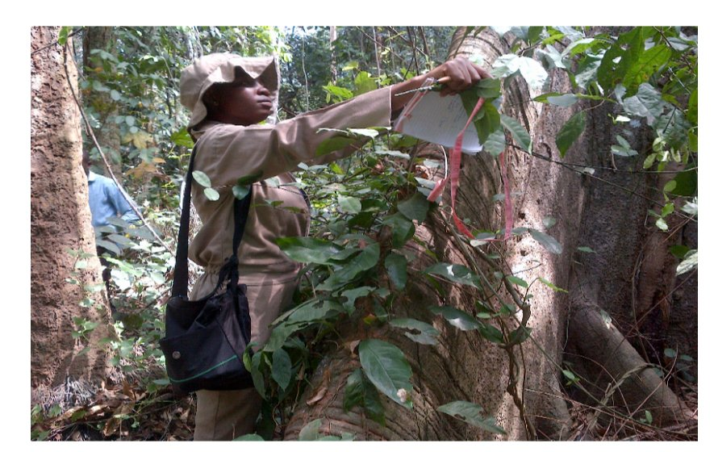

# Forest Allometry 🌳

[](https://www.r-project.org/)
[](LICENSE)

**Allometric equations and forest inventory analysis tools for Nigerian tropical hardwood species.**

This repository contains field-validated models for tree height, volume, and above-ground biomass estimation, developed from inventory data collected in Nigerian forest reserves.

<p align="center">
  
</p>

---

## 📋 Overview

Forest biometrics models developed from primary field data collection in Nigerian forest reserves. This repository contains **real field measurements** from 699+ trees across multiple study sites:

| Dataset | Location | Species | Trees | Variables |
|---------|----------|---------|-------|-----------|
| Biomass Study | Ajibode & Omo | Teak, Opepe | 200 | 51 (complete) |
| Diameter Study | Gambari | Obeche | 499 | DBH, Weibull |

**Study Sites:**
- **Gambari Forest Reserve** (Oyo State) - *Triplochiton scleroxylon* (Obeche)
- **Omo Forest Reserve** (Ogun State) - *Nauclea diderrichii* (Opepe)
- **Ajibode Plantation** (Oyo State) - *Tectona grandis* (Teak)

### Species Covered

| Species | Common Name | Local Name | Primary Use |
|---------|-------------|------------|-------------|
| *Triplochiton scleroxylon* | Obeche/Ayous | Arere | Plywood, furniture |
| *Tectona grandis* | Teak | Teak | Construction, furniture |
| *Nauclea diderrichii* | Opepe/Bilinga | Opepe | Heavy construction |

---

## 🔬 Methods Implemented

### 1. Diameter Distribution Analysis
- **Weibull (3-parameter)** probability density function
- Goodness-of-fit testing (Kolmogorov-Smirnov, Chi-square)
- Diameter class characterization

### 2. Height-Diameter Models
Three non-linear regression models:
- **Inverse function**: H = a + b/D
- **Chapman-Richards**: H = a × (1 - e^(-bD))^c
- **Wykoff**: H = 1.3 + e^(a + b/(D+1))

### 3. Volume Models
- **Combined variable**: V = a × (D²H)^b
- **Schumacher-Hall**: V = a × D^b × H^c
- **Logarithmic (Spurr)**: ln(V) = a + b×ln(D) + c×ln(H)

### 4. Above-Ground Biomass Models
Multivariate analysis approach:
- Principal Component Analysis (PCA) for variable selection
- K-means clustering for tree size classification
- Linear and non-linear allometric equations
- Basuki-type pantropical models

### 5. Taper Equations & Log Scaling (Sawmill Applications)
- **Taper models**: Polynomial, Ormerod, Kozak variable-exponent
- **Log scaling rules**: Smalian, Huber, Newton formulas
- **Board foot rules**: Doyle, Scribner, International 1/4-inch
- **Bucking optimization**: Maximize log value from stem
- **Log volume tables**: Ready for field use

*Note: Taper analysis demonstrates methodology using a single sample tree (DBH=56.5cm, H=26.2m). The same approach scales to larger datasets.*

---

## 📁 Repository Structure

```
nigerian-forest-allometry/
│
├── data/
│   ├── teak_opepe_biomass_data.csv  # 200 trees, 19 variables (REAL DATA!)
│   ├── obeche_dbh_gambari.csv       # 499 DBH measurements
│   ├── obeche_stem_profile.csv      # Sectional measurements for taper
│   └── [generated outputs]
│
├── R/
│   ├── 01_diameter_distribution.R   # Weibull fitting
│   ├── 02_height_diameter_models.R  # H-D relationships
│   ├── 03_volume_models.R           # Volume equations
│   ├── 04_biomass_models.R          # AGB estimation
│   └── 05_taper_log_scaling.R       # Sawmill applications
│
├── figures/
│   └── [Generated plots]
│
├── docs/
│   └── fieldwork.png
│
├── README.md
└── LICENSE
```

---

## 🚀 Quick Start

### Prerequisites
```r
install.packages(c("fitdistrplus", "minpack.lm", "ggplot2", 
                   "dplyr", "tidyr", "corrplot", "factoextra"))
```

### Run Analysis
```r
# Clone repository
# git clone https://github.com/[username]/nigerian-forest-allometry.git
# setwd("nigerian-forest-allometry")

# 1. Diameter distribution
source("R/01_diameter_distribution.R")

# 2. Height-diameter models
source("R/02_height_diameter_models.R")

# 3. Volume models
source("R/03_volume_models.R")

# 4. Biomass models
source("R/04_biomass_models.R")
```

---

## 📊 Key Results

### Weibull Parameters for Obeche (Gambari)
| Parameter | Value | Description |
|-----------|-------|-------------|
| Shape (k) | ~2.5 | Controls distribution shape |
| Scale (λ) | ~65 | Related to mean diameter |
| Location (θ) | 31.6 | Minimum threshold (cm) |

### Recommended Models

**Height prediction:**
```
H = 35 × (1 - e^(-0.025 × DBH))^1.0
```

**Volume prediction (Schumacher-Hall):**
```
V = 0.00005 × DBH^1.9 × H^1.0
```

**Above-ground biomass:**
```
AGB = exp(-2.5 + 2.4×ln(DBH) + 0.5×ln(H))
```

### Log Volume Scaling (Sawmill Industry)

| Method | Formula | Use Case |
|--------|---------|----------|
| Smalian | V = L × (A₁ + A₂) / 2 | Quick field scaling |
| Huber | V = L × Aₘ | Mid-point measurement |
| Newton | V = L × (A₁ + 4Aₘ + A₂) / 6 | Most accurate |

**Board Foot Rules:**
- **Doyle**: Conservative (favors buyer)
- **Scribner**: Moderate
- **International 1/4"**: Most accurate

---

## 📸 Field Work

Data collection followed standard forest inventory protocols:
- **Plot design**: 15 randomly selected plots (25m × 25m)
- **Measurements**: DBH (diameter tape), height (hypsometer), crown dimensions
- **Stem analysis**: Sectional diameter measurements at 1m intervals
- **Destructive sampling**: Selected trees for biomass validation

---

## 📚 References

Key literature informing this work:

1. Clutter, J.L. et al. (1983). *Timber Management: A Quantitative Approach*
2. Avery, T.E. & Burkhart, H.E. (2002). *Forest Measurements*
3. Chave, J. et al. (2014). Improved allometric models to estimate AGB of tropical trees. *Global Change Biology*
4. Basuki, T.M. et al. (2009). Allometric equations for estimating AGB in tropical lowland forests. *Forest Ecology and Management*

---

## 👤 Author

**Oluwadamilola Ogundipe**
- MSc Forest Biometrics, University of Ibadan, Nigeria
- MSc Mediterranean Forestry & Remote Sensing, University of Padova, Italy
- PhD Candidate, Environmental Science, ETH Zurich

## 🙏 Acknowledgments

**Field Data Collection Team & Acknowledgment:**
- Oluwadamilola C. Ogundipe
- Adeboye Adetunji Adetola
- Olukunle Damola
- Dr. Ogana Friday

**Supervisors:**
- Dr. S.O. Oyamakin ( Multivariate Analysis)
- Dr. A.A. Alo (Resource Inventory Analysis)

Data was collected as part of MSc coursework in Forest Biometrics at the University of Ibadan, Nigeria (2017-2018). We thank the Forestry Research Institute of Nigeria (FRIN) and the Oyo/Ogun State Forestry Departments for access to the study sites.

---

## 📄 License

This project is licensed under the MIT License - see [LICENSE](LICENSE) for details.

---

## 🤝 Contributing

Contributions welcome! If you have:
- Additional Nigerian species data
- Improvements to models
- Bug fixes

Please open an issue or submit a pull request.

---

## 📬 Citation

If you use these models in your research, please cite:

```
Ogundipe, O.C. (2018). Height-diameter and volume models for Triplochiton scleroxylon 
in Gambari Forest Reserve, Nigeria. University of Ibadan, Department of Social and 
Environmental Forestry.
```
